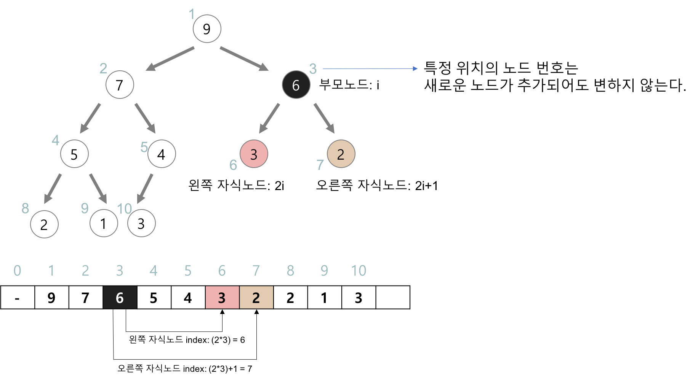

# Heap

우선 순위 큐를 위해 만들어진 자료구조, heap.

**우선순위 큐**

- 데이터들이 우선순위를 가지고 있고, 우선순위가 높은 데이터가 먼저 나감

**Heap**

- 완전 이진트리의 일종, 우선순위 큐를 위해 만들어진 자료구조
- 여러 개의 값들 중, 최댓값이나 최솟값을 빠르게 찾아내도록 만들어진 자료구조
- 힙은 일종의 **반정렬 상태**를 유지
- 힙 트리에서는 중복 된 값을 허용
- 종류
  - 최대 힙
    - 부모 노드의 키 값이 자식 노드의 키 값보다 크거나 같은 이진 트리
    - key ( 부모 ) ≥ key ( 자식 )
  - 최소 힙
    - 부모 노드의 키 값이 자식 노드의 키 값보다 작거나 같은 이진 트리
    - key ( 부모 ) ≤ key ( 자식 )
- 보통 배열로 구현
- 구현을 쉽게하기 위해 첫 번째 인덱스인 0은 사용되지 않음
- 특정 위치의 노드 번호는 새로운 노드가 추가 되어도 변하지 않음
- 힙에서의 부모 노드와 자식 노드의 관계

  - 왼쪽 자식의 인덱스 = (부모)\*2
  - 오른쪽 자식의 인덱스 = (부모)\*2+1
  - 부모의 인덱스 = (부모)//2

  

**Heap의 삽입**

- 새로운 요소가 들어오면, 일단 새로운 노드를 힙의 마지막 노드에 이어서 삽입
- 새로운 노드를 부모 노드들과 차례로 교환해서 힙의 성질을 만족 시킴

**Heap의 삭제**

- 최대 힙에서 최대 값은 루트 노드이므로, 루트 노드가 삭제 된다
- 삭제 된 루트 노드에는 힙의 마지막 노드를 가져온다
- 힙을 재구성한다.

